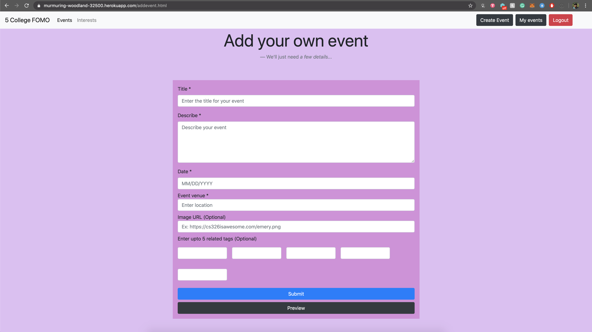
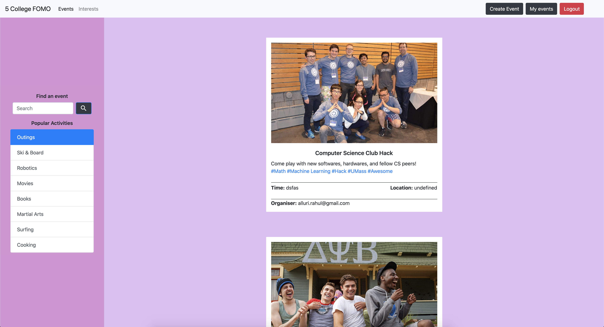
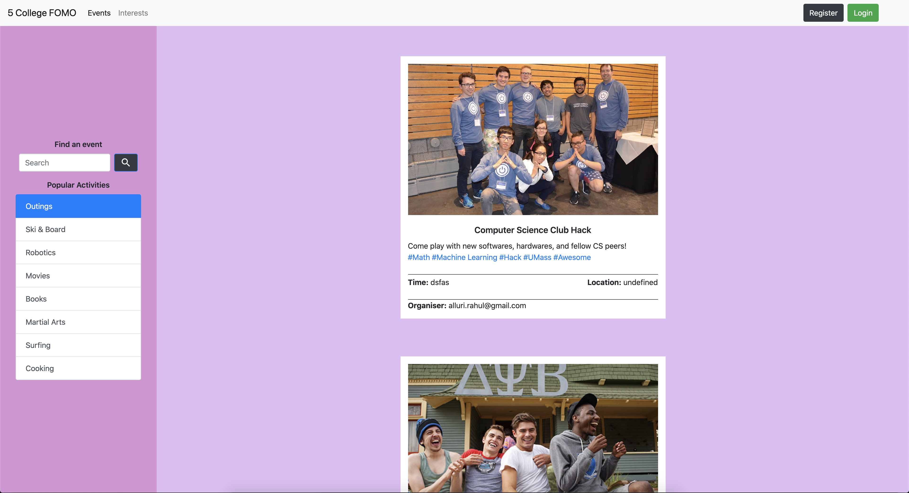
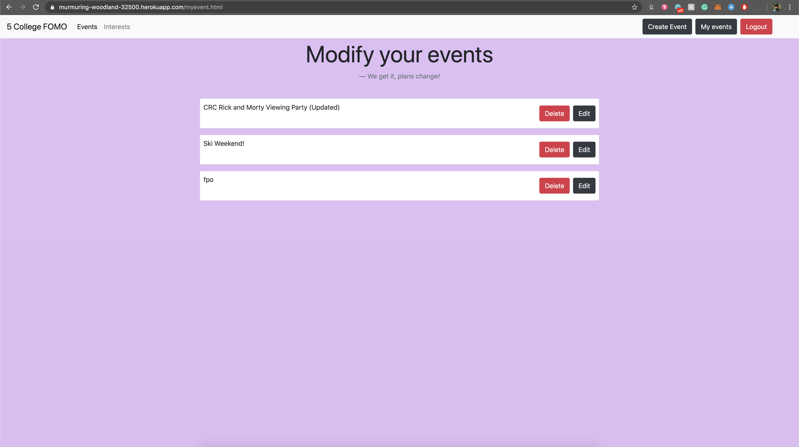
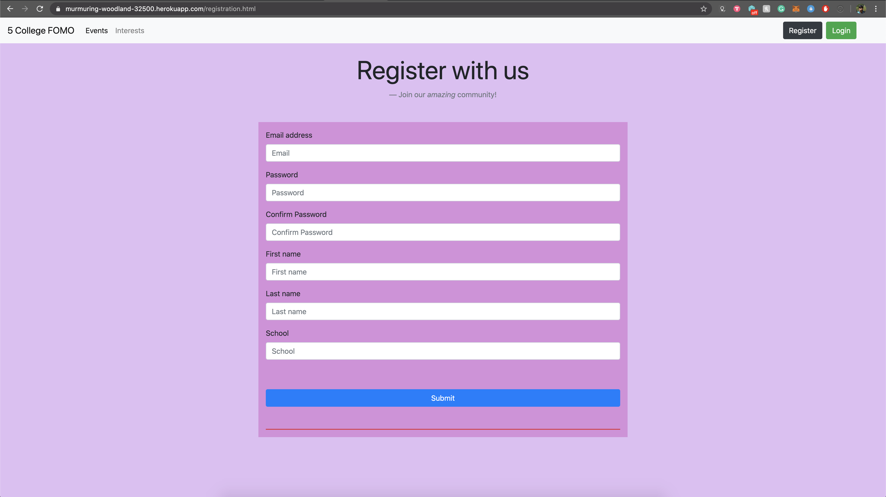
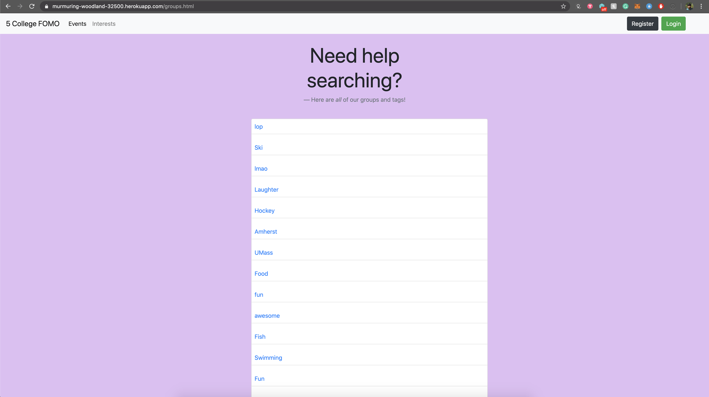
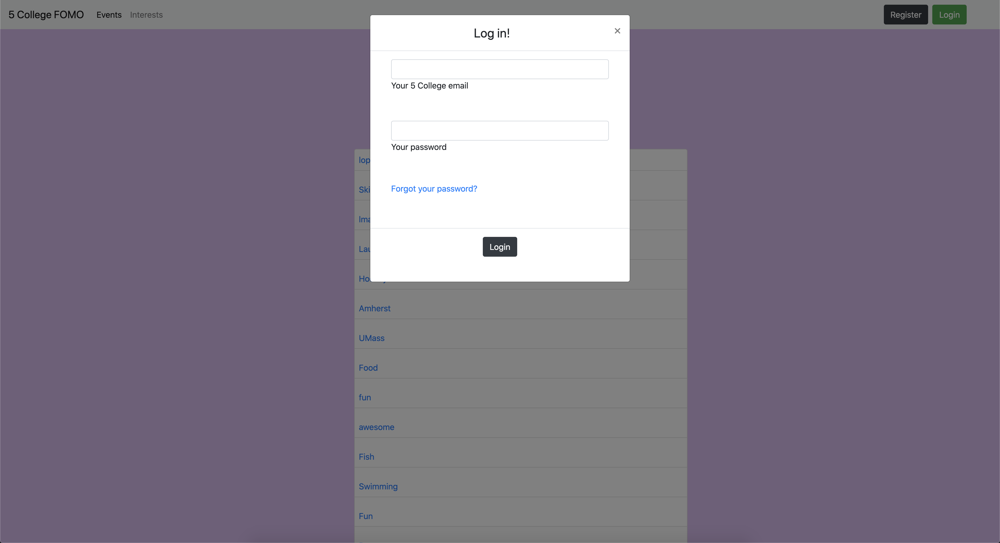

### 5College FOMO Final Project 05/07/20 

### MARKDOWN SUBMISSION

- Title: bet

- Subtitle: 5College FOMO

- The Website: https://murmuring-woodland-32500.herokuapp.com

- YouTube Link: https://www.youtube.com/watch?v=8BlAbxv33Os

- Semester: Spring 2020

- Overview:  **Five College FOMO** created a website to instill community and access to opportunity across the five college consortium. We believed that many students attending Amherst, Mount Holyoke, Smith, Hampshire, and UMass Amherst are not able to fully benefit from the vast five college network of clubs, events, guest lectures, and so forth due to lack of centralized information.

Although the Five Colleges do have a website, the utility is lacking. For example, instead of listing all orgs based off interests it simply redirects you to each individual college's listing thus making Googling more efficent than their site.

OUR Solution? **Five College FOMO** We have information at your fingertips based on your interest and upcoming events - whether that is looking for athletic clubs in the area, CS groups to attend hacks with, or religious celebrations of your denomination upcoming calendar. Plus, you as a user can add/edit/delete events of your own as you please to spread the word about YOUR upcoming event. 

# Team Members: Sathvik Birudavolu @BSathvik, Emma Wolff @wolff23e, Rahul Alluri @ralluri-sudo  

# User Interface 

- addevent.html: Allows user to add event to event database


- index.html: displays recent events, and allows users to search through all events
    - When logged in:


    - When logged out:
    

- myevent.html: Allows user to see all events they have posted, so they can edit/delete, or just view! 

- registration.html: Allows users to create a account with 5CFOMO. 

- groups.html: Allows users to see "Interests" tags on events such as; UMass, Bars, Hiking, et cetera. 

- log in: Allows users to log into their accounts! 


# APIs
- Please use the Postman doc link to see the list of API endpoints with examples and descriptions:<a href="https://documenter.getpostman.com/view/3593173/Szf52oX6?version=latest"> API Postman Documentation Link</a> 


# Database
- Utilized MongoDB Atlas to host all events as json objects, Utilized MongoDB Atlas to host all users with accounts on 5College Fomo, as well as corresponding account data 

- Out MongoDB database has two collections, one for users and one for events.

### Example User Data

```
{
    "_id":"sbirudavolu@umass.edu",
    "email":"sbirudavolu@umass.edu",
    "firstname":"Sathvik",
    "lastname":"Birudavolu",
    "school":"UMass Amherst",
    "password":"$2b$05$CBjh258KexpYWFA3O12F6OhMeIdu7dtLgNur7XlOWxPNSrJ16BViS"
}
```

### Example Event Data

```
{
    "_id":"d40098b2dd921154ac210ece6712b11ac7f885a76025fa1dd9ac02f3d9e962fe",
    "id":"d40098b2dd921154ac210ece6712b11ac7f885a76025fa1dd9ac02f3d9e962fe",
    "title":"CRC Rick and Morty Viewing Party (Updated)",
    "description":"Come watch Rick and Morty with CRC for our end of the year online gather",
    "image":"https://thetecheducation.com/wp-content/uploads/2020/04/rick-morty-feat-1000x600.jpg",
    "location":"ZOOM: 3253495734857",
    "tags":["lmao","","","",""],
    "eventStartTime":"05/28/2020",
    "author":"sbirudavolu@umass.edu",
    "postTimestamp":1588913758
}
```


# URL Routes/Mappings

Please refer to the postman docs the <a href="https://documenter.getpostman.com/view/3593173/Szf52oX6?version=latest"> postman docs</a> for descriptions as well as examples.

-  `/` : servers all the static pages/files.

- `/api`: endpoint for API

- `api/user/register`: User registration

- `api/user/login`: User login (return JWT Token)

- `api/user/login`: User login (return JWT Token)

- `api/event/recent`: gets the recently posted events.

- `api/event/tags`:  gets a list of tags.

- `api/event/getbytags`: gets a list of events given a tag.

- `api/event/mylist`: gets specific user posted events.(requires JWT Token)

- `api/event/create`: creates a new event (requires JWT Token)

- `api/event/update`: updates existing event (requires JWT Token)

- `api/event/delete`: deletes existing event (requires JWT Token)


# Authentication/Authorization
- Users are authenticated by creating an account which is stored in our Atlas MongoDB database. All users carry the same permissions, which are greater than non-users. Non-users may view Main events page as well as Interests (groups.html & index.html), but cannot do what users can, which is: post events, edit events, and delete events. Once User is signed in our navbar rids them of register/log in, and gives them option to log off.

- Passwords are salted and hashed using bycrpt before being stored in MongoDB.
- We use JWT Tokens for authentication provided by [jsonwebtoken](https://www.npmjs.com/package/jsonwebtoken) npm package.
- The JWT token is generated when the user logs in using a secret key stored in `secret.json` on the master branch and which is stored as a Heroku Env Variable in `final-release` branch which is pushed to heroku.
- This JWT Token is stored in `localStorage` in the browser and is used for requests that require specific user authentication (ex: update, delete) listed below. That means users will only able to edit or delete events they've created.
- The token is deleted when the user logs out.


# Division of Labor
- Sathvik Birudavolu, @BSathvik, Backend & Frontend: Made events main feed page, Back end skeleton, API point client side for registering, login, tags and create event. Deployment, API documentation, HTML organising and formatting, login, registration, jwt authentication (for all requests requiring auth), create event, delete event. 

- Emma Wolff, @wolff23e, Backend & Frontend: Drew wireframe, initial CSS/html implementation, markdown1.md, View all tags and events, Interests page will load tags, unified overall layout, modify events, getEventsByTag, tagInterestDisplay, Atlas event edits, final UI, finalmd

- Rahul Alluri. @ralluri-sudo, Backend & Frontend: Made clubs & orgs page, made create events, made log-in, API point client side for login(public/js/user.js). Minor CSS and HTML editing, milestone2, GeteventbyID, updateEvent, getUserevents, Edit events, Update events, show event list


# Conclusion
- A conclusion describing your team’s experience in working on this project. This should include what you learned through the design and implementation process, the difficulties you encountered, what your team would have liked to know before starting the project that would have helped you later, and any other technical hurdles that your team encountered.

- As team bet we are grateful and pleased to have this project completed. We learned a lot about ensuring our UI is inclusive and accessible to all users. Originally, we had a much different UI layout but we quickly realized this design was not easy to read error messages within, making it inaccessible to anyone with bad sight. Further, the utilization of MongoDB proved to be quite the learning experience for our group. Though we wished we had realized this sooner, it was a great realization that you can directly edit the event object on the Atlas site. This saved us a lot of time when working with tags/transitioning from static placeholders to dynamically pulling data from our database. We struggled at one point with differing communication preferences, but after all voicing our concerns/opinions, we were able to overcome this hurdle and finish strong regardless. One of the technical hurdles for each of us, in differing ways, was approaching software/languages we weren't the most confident with. Thankfully we visited endless stackoverflow forums, and sometimes other members of the team knew the answer or gave a good prompt to finding the solution. Overall, we all learned a lot about team management, communication styles, routing, the PostMan API, mongoDB, UI design and implementation, GitHub, and much more. 

